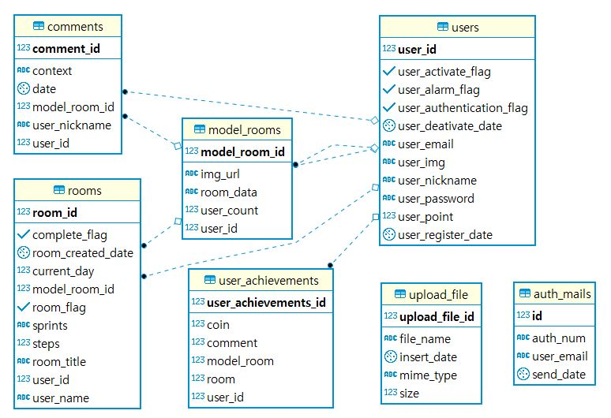

## PaceMaker Release

 PaceMaker는 특정 목표에 도달한 사람들이 목표를 이루기 위해 사용한 방법을 목표에 도달하고 싶은 사람들에게 더욱 쉽게 공유합니다. 그리고 공유를 받은 방 법으로 To Do List를 자동 생성해줍니다. 또한, 목표 성취를 돕기 위해서 재미요 소인 업적 시스템을 도입한 사이트입니다. 

 저는 주로 2, 3번을 담당하였습니다. 

1. 회원관리 CRUD
2. 개인룸, **모델룸** CRUD
3. **REST API**
4. 업적 관리 기능
5. 댓글 기능

### 시연영상

https://www.youtube.com/watch?v=7eANC6L_FkU&t=3s

### 사용된 기술

- 백엔드: **Spring** Boot, **JPA**, Lombok
- 프론트엔드 프레임워크: **Nuxt** 2.0, **Vuetify** 2.0
- 프론트엔드 서버: **NodeJS**
- 인프라: **Docker**, AWS
- DATABASE : **PostgreSQL** 11

### 프로젝트 상세 기술

- **JPA**를 이용한 **ORM**형식의 DB 연결

  - 개발자가 비지니스 로직에 집중할 수 있게 사용
  
  - DB ERD

  

- **Docker**와 AWS를 사용

  - front, back, db를 컨테이너화해서 관리, OS의 의존성을 줄임

- **Nuxt**를 사용한 사용자 검색 유입 증대

  - **SSR**(Server Side Rendering)를 이용한 검색엔진 최적화(SEO)

- **반응형** 하이브리드 웹 앱

  - **Vuetify**를 사용하여 모바일과 데스크탑에 맞는 CSS 제공

- **Model Room** 기능

  - 가이드라인 계획을 세워 다른 사용자(공개시)가 해당 계획을 가지고 쓸 수 있도록 함

- **Room** 기능

  - Model Room을 통해 생성된 계획 리스트 체크와 추가 기능 제공
  - 스프린트 Bar Graph를 통해 계획 진행률 한눈에 파악 가능
  - 동일 Model Room 사용시, 생성한 개인방에서 댓글을 통하여 소통할 수 있도록 기능 제공

- **업적** 기능

  - 설정해놓은 업적 기준치 달성시, 업적 뱃지 획득

- **포인트** 기능

  - 일정 계획 수행시마다 포인트 제공
